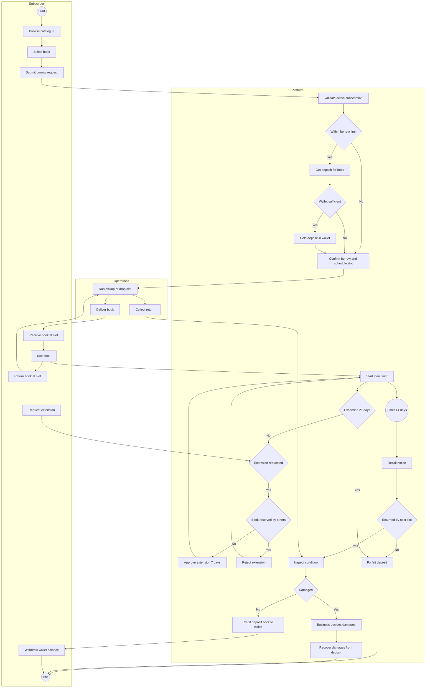
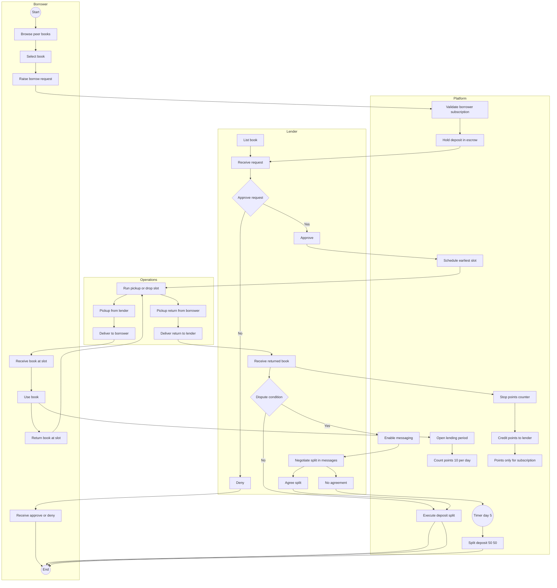

# BPMN-style Process Flows (Markdown)

This document describes **two separate BPMN-style process flows** for a book-lending business model:

1. **Business-owned books** (business owns + lists inventory)
2. **Peer-owned books** (peers own + list inventory)

> Note: These are BPMN-*style* diagrams rendered in Markdown using Mermaid. They include BPMN concepts like **events, gateways, timers, lanes/roles, and message flows**.

---

## 1) Business-Owned Books — Borrow + Return + Deposits

### Actors / Lanes

* **Subscriber**
* **Business Platform** (app + wallet + rules engine)
* **Operations** (pickup/drop slots)

---

### BPMN-style flow (Mermaid)

---

### Key Rules Captured

* Borrowing requires:

  * Active subscription
  * Within simultaneous borrow limit
  * Per-book deposit available and held
* Loan duration:

  * **Max 21 days** → deposit forfeited if exceeded
  * Optional **7-day extensions**, repeatedly, but only if book not reserved/wishlisted
* Recall:

  * Business may recall **after 14 days**
  * If not returned by next slot → deposit forfeited
* Condition disputes:

  * Business decision is final
  * Deposit used to recover damages
* Wallet:

  * Deposit credited back if returned in good condition
  * Subscriber may withdraw wallet balance any time or on account closure

---

## 2) Peer-Owned Books — Request + Approval + Deposit + Dispute + Points

### Actors / Lanes

* **Borrower (Subscriber)**
* **Lender (Peer Owner)**
* **Business Platform** (escrow deposit + messaging + arbitration)
* **Operations** (pickup/drop slots)

---

### BPMN-style flow (Mermaid)

---

### Key Rules Captured

* Anyone may list books.
* Borrowing requires:

  * Borrower raises request
  * Lender approves
  * Business holds deposit in escrow for lender
* Scheduling:

  * Executed on **earliest delivery/pick-up slots**
* Disputes:

  * Business enables lender/borrower messaging
  * They must agree on deposit split
  * If no agreement by **day 5**, business splits deposit **50/50** (final)
* Points:

  * Lender earns **10 points/day** while lent
  * **Transit time excluded**
  * Points = **₹1 each**, usable only to pay subscription fees
  * Points can **never** be withdrawn

---

## Optional Add-on: Shared Weekly Slot Scheduling (Reusable Subprocess)

If you want, I can also add a reusable subprocess diagram for:

* Slot calendar generation (2+ weekly slots)
* Matching “earliest slot” for pickup and return
* Handling missed slots

---

## Next Upgrade (If You Want)

If you want these to be *even more BPMN-like*, I can produce a version with:

* Explicit **message flows**
* Separate **pools** (Subscriber vs Business vs Peer)
* Explicit **intermediate timer events** (21-day, 14-day recall, day-5 dispute)
* A compact layout suitable for investor pitch decks
